# Abstract {-}

\newpage

# Introduction {#sec:introduction}

Organized sports represent a cornerstone of global culture and entertainment. Beyond their intrinsic appeal, the sports industry and its major sporting 
events have had significant impact on economic growth in China [@wu2024], including the emergence and growth of related industries, such as sports betting [@aga2025]. 
In the United States (U.S.), sports betting generated $11.34 billion in revenue from January through September 2024, reflecting a year-over-year growth of 13.4% [@aga2025]. 
This expansion subsequently increases the economic stakes associated with accurately predicting sports outcomes, as both bettors and 
stakeholders seek to leverage data-driven insights for competitive advantage.

As an exemplary domain for sports forecasting, this project tackles the problem of predicting NCAA basketball tournament outcomes through deployment and comparison of naive 
statistical and machine learning (ML) approaches. Our work is framed within the context of the Kaggle competition "March Machine Learning Mania 2025," which tasks 
participants with forecasting match results for both the men's and women's NCAA Division I March Madness basketball tournaments [@mmlm2025]. 
While our primary objective is to maximize predictive performance on the competition leaderboard, we also aim to evaluate the relative strengths 
and limitations of different modeling strategies.

The NCAA March Madness tournaments serve as particularly compelling case studies for sports prediction, shown through the research of @kim2023 
and their application of various ML approaches. These single-elimination competitions determine the national champions in Division I college basketball, 
with each tournament featuring 68 teams competing over approximately three weeks in March and April. Teams qualify through two mechanisms: Automatic bids 
awarded to conference tournament winners, and at-large selections based on regular season performance metrics. The selection committee then assigns seeds 
within four regional brackets, establishing the tournament structure and initial matchups [@ncaa_marchmadness2025].

We approach this challenge by implementing and comparing several modeling frameworks, ranging from traditional statistical methods to state-of-the-art (SOTA)
machine learning methods. Our analysis addresses three central questions: First, what level of predictive accuracy can be achieved using different 
methodological approaches? Second, how do factors such as data availability, feature engineering, and model architecture influence prediction quality? 
Third, are there meaningful differences in predictability between the men's and women's tournaments that reflect underlying competitive dynamics?

## Kaggle Competition

The "March Machine Learning Mania 2025" competition on Kaggle [@mmlm2025] is an annual event that challenges data scientists
and sports enthusiasts to develop models predicting the outcomes of the "March Madness" NCAA Division I basketball championship tournaments. 
Participants are provided with a carefully curated dataset including historical game results, team statistics, and tournament brackets from previous years. 
A submission consists of predicted win probabilities for every possible matchup for both women's and men's tournaments in 2025. 
Every participating team may mark two submissions for evaluation on the public leaderboard of which the better one is considered. 
The evaluation metric used in the competition is the Brier score [@brier1950], which is mathematically identical to the mean squared error between 
predicted probabilities and binary outcomes. The competition started on February 10, 2025, and ended on March 20, 2025, giving teams exactly
one month to develop and refine their models. Also, the competition includes a prize money pool of $50,000 attracting 1,727 teams that 
are listed on the competition's leaderboard.

# Existing Research

The prediction of NCAA Division I basketball tournament outcomes represents a compelling intersection of sports
analytics, statistical modeling, and machine learning. Each year, the NCAA men's and women's basketball tournaments
captivate millions of viewers and generate billions of dollars in legal and illegal wagers [@kvam2006].
Despite this enormous interest and the application of increasingly sophisticated predictive methods, no verifiable
perfect bracket has ever been documented [@mciver2025], with estimated odds of correctly predicting all
tournament games at approximately 1 in 120.2 billion even with basketball knowledge [@sprint2024]. The
single-elimination format and inherent unpredictability of tournament play create a challenging prediction environment
that has motivated researchers to develop approaches ranging from traditional statistical methods to state-of-the-art
machine learning architectures.

## Traditional Statistical Approaches

Early research in NCAA tournament prediction largely relied on seed-based methodologies, exploiting the tournament
selection committee's rankings of teams from 1 (strongest) to 16 (weakest) within each regional bracket.
@stekler2012 demonstrated that seed-based predictions using probit models achieved approximately 72.3%
accuracy across the first four rounds of tournaments from 2003 to 2010, while consensus rankings from multiple polling
sources achieved marginally better performance at 73.6%. However, these seed-based approaches face fundamental
structural limitations. As @stekler2012 notes, "the seedings in the regional rounds cannot be used in making
predictions for these final two rounds" because seeds only provide relative rankings within regions rather than absolute
team strength across the entire tournament field. This constraint necessitates alternative approaches for predicting
Final Four and championship outcomes.

Beyond simple seed comparisons, researchers developed more sophisticated rating systems to estimate team strength.
@kvam2006 compared their proposed model against established systems including the Associated Press poll,
ESPN/USA Today coaches poll, the Ratings Percentage Index (RPI), and the Sagarin and Massey ratings. Each of these
systems attempts to rank teams based on combinations of winning percentage, strength of schedule, and opponent quality.
@shen2016 provides a comprehensive literature review of traditional methods, highlighting the progression
from purely win-loss based approaches to models incorporating margin of victory and opponent strength. The consistent
finding across these traditional statistical approaches is that while seed-based predictions provide a reasonable
baseline, they leave substantial room for improvement through more nuanced team strength estimation.

## Rating Systems and Team Strength Estimation

Rating systems provide dynamic, continuously updated measures of team strength that overcome many limitations of static
tournament seeds or seasonal win-loss records. @kvam2006 introduced a Markov chain model for NCAA basketball
where teams represent states and game outcomes determine transition probabilities. Their approach uses logistic
regression to populate these transition probabilities based on win-loss records, home advantage, and margin of victory,
requiring only basic scoreboard data. The steady-state probabilities of the Markov chain then provide team rankings,
with the intuition that "the current state of the voter corresponds to the team that the voter now believes to be the
best" [@kvam2006].

The Elo rating system, originally developed for chess by Arpad Elo [@Elo1978], has been extensively adapted for
basketball and other team sports. @gomez2024 provides formal mathematical foundations for Elo in sports
contexts, explaining how the system updates team ratings after each game based on the expected versus actual outcome.
The probability that team A defeats team B is modeled as a logistic function of their rating difference, with the victor
gaining rating points (and the loser losing an equal amount) proportional to the upset magnitude. @gomez2024
extends the classical Elo framework through stochastic process formulations that enable score prediction throughout a
game rather than just final outcomes. For basketball specifically, the authors demonstrate that Elo-based systems
achieve competitive predictive performance while maintaining computational simplicity and interpretability.

Dynamic rating systems that separately track home and away performance or incorporate temporal decay of older results
offer further refinements. While @constantinou2013 develops their pi-rating system for football,
their methodology of maintaining separate home and away ratings with learning rates that determine how newly acquired
information updates ratings provides insights applicable to basketball. The key principle, as they state, is that "a
rating system should provide relative measures of superiority between adversaries and overcomes all of the above
complications" of static league tables or tournament seeds [@constantinou2013]. Empirical evidence from
basketball analytics supports these dynamic approaches: @migliorati2021 demonstrates in NBA contexts that
models using Elo ratings or relative win frequencies substantially outperform models based on complex box score
statistics, suggesting that carefully designed single features capturing team strength can be more effective than
high-dimensional statistical aggregations.

## Feature Engineering: Beyond Box Scores

While traditional box score statistics (field goal percentages, rebounds, assists, turnovers) provide obvious predictive
signals, research increasingly demonstrates the value of alternative feature sources. @lopez2015 argues
that Las Vegas point spreads (betting odds) represent highly efficient aggregations of available information, as sportsbooks have
strong incentives to set accurate lines to balance betting action. Their winning entry in the 2014 Kaggle March Machine
Learning Mania competition combined point spread data with possession-based efficiency metrics from Ken Pomeroy's
analytics platform. As they conclude, "we provide evidence that the combination of modest statistical methods with
informative data can meet or exceed the accuracy of more complex models" [@lopez2015]. Pomeroy's efficiency
metrics, detailed in @lopez2015, measure offensive and defensive points per 100 possessions adjusted for
opponent strength, offering normalized team performance measures that account for pace-of-play variations across teams.

A critical insight from recent research concerns data contamination. @yuan2015 explicitly addresses this
issue in their mixture-of-modelers approach, defining contaminated data as "archival data for a given NCAA season which
incorporated the results of the final tournament from that year." Many publicly available datasets and rating systems
update continuously throughout the season, inadvertently including post-tournament information when researchers train
models on historical data. For example, metrics like games played (GP) strongly predict tournament success in historical
data simply because teams that advance further play more tournament games, but this information is not available
pre-tournament for new predictions. @yuan2015 demonstrates that careful use of pre-tournament versions of
rating systems substantially improves genuine predictive performance.

Beyond statistical metrics, @kim2023 emphasizes non-box score factors that influence tournament outcomes.
Their analysis of 1370 tournament games from 2006-2017 incorporates conference affiliation, geographic proximity to 
tournament venues (enabling larger fan support), travel distance and time zone effects on player performance, 
and teams' historical tournament experience. As they note, "little research has focused on situational factors in 
predicting sports tournament outcomes" [@kim2023], yet these contextual elements can substantially impact game results. 
Recent deep learning applications further expand the feature space: @habib2025 combines Elo ratings with GLM-based team
quality metrics derived from historical match results and strength of opposition, demonstrating that sophisticated
feature engineering enhances model performance across multiple architectures.

## Ensemble and Mixture Approaches

Ensemble methods that combine predictions from multiple models have proven particularly effective for tournament
prediction. @yuan2015 documents their mixture-of-modelers approach where a Harvard University team
collectively developed over 30 different models for the 2014 NCAA tournament. These models employed diverse algorithms
including multiple variants of logistic regression (with L1 regularization, L2 regularization, and backward elimination
for feature selection), decision trees, and neural networks. The team optimized predictions using log loss as the
evaluation metric, leading to probability estimates that are well-calibrated instead of merely accurate classifications. 
Eventually, their ensemble strategy improved robustness against overfitting to particular patterns in the training data.

Comparative studies of individual algorithm performance provide context for ensemble benefits. @shen2016
evaluated Support Vector Machines (SVM), Random Forests (RF), and Bayesian models with probability self-consistency
constraints on March Madness data, finding RF achieved 68.2% accuracy, SVM 66.1%, and their Bayesian approach
approximately 50%. Similarly, @kim2023 compared five machine learning approaches on 685 tournament games,
reporting Neural Networks achieved the highest accuracy at 67%, followed by SVM (65%), k-Nearest Neighbors 
(63%), logistic regression (63%), and Random Forests (61%). These relatively modest performance differences across
algorithms, combined with the documented success of ensembles, suggest that model diversity and appropriate feature
engineering may be more important than algorithm selection alone.

A critical consideration for ensemble approaches in tournament prediction is the risk of overfitting to historical
tournament data. As @lopez2015 demonstrates through simulation, even with perfectly accurate game-level
probability estimates, the stochastic nature of tournament brackets means a model might have only approximately 12%
probability of finishing first among hundreds of competitors and less than 50% probability of finishing in the top ten.
This inherent variance motivates ensemble strategies that aggregate across different training approaches to reduce
model-specific overfitting while maintaining predictive accuracy.

## Machine Learning and Deep Learning Approaches

The progression from classical machine learning to deep learning architectures reflects both methodological advancement
and the challenge of limited training data in NCAA contexts. Classical ML comparisons consistently show competitive
performance across algorithms when provided with well-engineered features. @kim2023 reports that 
Neural Networks marginally outperformed other classical algorithms (67% vs 61-65% accuracy), though all approaches
clustered within a narrow performance range. @shen2016 similarly finds Random Forests and SVMs performing
comparably (68% vs 66%). These modest differences suggest that for NCAA prediction, where training data is limited to
historical tournament games (63 games per season and team), the choice among classical ML algorithms matters less than feature
quality and avoiding overfitting.

Recent work has explored deep learning architectures specifically designed for sequential and temporal data.
@habib2025 compares Long Short-Term Memory (LSTM) networks and Transformer models for predicting the 2025
NCAA tournaments using data from 2003-2024. Their comprehensive feature set includes Elo ratings, GLM-based team quality
metrics, tournament seeds, and aggregated box score statistics. Critically, they evaluate models using both Binary
Cross-Entropy (BCE) loss and Brier loss functions, revealing important tradeoffs: Transformer models optimized with BCE
achieved superior discriminative power (AUC of 0.8473), while LSTM models trained with Brier loss demonstrated better
probabilistic calibration (Brier score of 0.1589). As @habib2025 discusses, the choice between maximizing
discrimination versus calibration depends on the specific prediction task and evaluation criteria.

@migliorati2021 examines feature selection through deep learning for NBA prediction, demonstrating that
relatively simple Neural Network architectures (few layers, modest numbers of units) can achieve strong performance when
the input features effectively capture team strength. Their finding that single features like Elo ratings outperform
complex box score aggregations suggests that deep learning's primary value may lie in learning optimal feature
representations rather than necessarily requiring deep architectures. The development of home/away feature variants
further illustrates how domain knowledge about basketball (home court advantage effects) can be incorporated into neural
network inputs.

Novel approaches continue to emerge. @sprint2024 explores using Large Language Models (LLMs) with social
network data, collecting over 1.1 million tweets from official Division I team Twitter accounts across 2021-23 seasons.
Their approach employs few-shot and zero-shot learning techniques, feeding recent tweets as context to LLMs to predict
game outcomes, and combining LLM-generated embeddings with XGBoost for classification. While innovative, these
cutting-edge methods have not yet demonstrated clear superiority over well-executed traditional approaches, highlighting
the ongoing challenge of balancing methodological novelty with practical prediction performance.

## Model Evaluation and Quantifying Success

Appropriate evaluation metrics are crucial for assessing predictive performance, particularly in probabilistic
forecasting contexts. @stekler2012 employs the Brier Score (also called Quadratic Probability Score), which
measures the mean squared error between predicted probabilities and binary outcomes. For each game, if a model predicts
team A has probability p of winning and A actually wins, the contribution to the Brier Score is $(1-p)^{2}$, while if A loses
it is $p^{2}$ [@brier1950]. This metric explicitly penalizes confident incorrect predictions more heavily than uncertain predictions,
encouraging well-calibrated probability estimates.

@yuan2015 details the log loss evaluation function used in passed Kaggle competitions, defined as the negative
log-likelihood of the observed outcomes given predicted probabilities. Mathematically, for N games with predicted
probability $\hat{y}_i$ and observed outcome $y_i$, log loss equals $-\frac{1}{N}\sum_{i=1}^{N}[y_i \log(\hat{y}_i) + (1-y_i)\log(1-\hat{y}_i)]$. 
This metric, equivalent to the loss function minimized in logistic regression, heavily penalizes confident incorrect predictions (approaching
infinity as $\hat{y}$ approaches 0 for an observed win). @habib2025 discusses the distinction between
discriminative metrics like AUC-ROC (measuring a model's ability to rank teams correctly) and calibration metrics like
Brier score (measuring whether predicted probabilities match empirical results), noting that optimization for one
may not guarantee optimization for the other.

## Synthesis and Research Gaps

The existing research reveals several consistent themes across methodologies and time periods. First, feature
engineering and data quality consistently emerge as more important than algorithm selection. @lopez2015's success with 
"modest statistical methods" combined with Las Vegas spreads and @migliorati2021's finding that simple Elo ratings
outperform complex box score models both underscore this principle. Second, ensemble approaches that aggregate
predictions across diverse models generally outperform individual models, as @yuan2015's mixture-of-modelers work
demonstrates. Third, proper evaluation requires careful attention to both the metrics employed and the role of
stochastic variation in tournament outcomes.

Several limitations persist across the literature. The scarcity of training data remains fundamental—with only 63
tournament games per season and team, and structural changes in team composition from year to year, models risk overfitting to
small sample statistical noise. The data contamination issue highlighted by @yuan2015 suggests that reported historical
performance may overstate true predictive capability when researchers inadvertently include post-tournament information.
The persistent difficulty in predicting upsets, particularly in early rounds where lower-seeded teams occasionally
defeat favorites, indicates that current approaches may not fully capture the factors driving individual game variance.

# Data {#sec:data}

The dataset used for this project was obtained from the Kaggle competition "March Machine Learning Mania 2025" [@mmlm2025]. 
It consists of a total of 36 CSV files containing various information about NCAA Division I basketball games, teams, venues, coaches and tournaments.

## Data Description {#sec:data-description}

For this project, only a subset of the data available was used. All data used contains historical information up to and including the 2025 regular season. These are described in the following sections.

### Regular Season Detailed Results {#sec:regular-season-detailed-results}

The regular season detailed results contain basic game information as well as box-score statistics for every NCAA Division I basketball game played in the regular season. For men's basketball the available data starts with the 2003 season and for women's basketball with the 2010 season. @tbl:regular-season-detailed-results describes the features available in this dataset. Features containing \[WL\] in their name are available for both the winning and losing team of a game, e.g. "WTeamID" and "LTeamID" for the winning and losing team IDs respectively.

| Feature      | Description                              |
|--------------|------------------------------------------|
| Season       | The season in which the game was played  |
| DayNum       | The day number within the season (1-133) |
| \[WL\]TeamID | The ID of the team                       |
| \[WL\]Score  | The score of the team                    |
| WLoc         | The location of the winning team (H/A/N) |
| NumOT        | Number of overtime periods played        |
| \[WL\]FGM    | Field Goals Made                         |
| \[WL\]FGA    | Field Goals Attempted                    |
| \[WL\]FGM3   | 3-Point Field Goals Made                 |
| \[WL\]FGA3   | 3-Point Field Goals Attempted            |
| \[WL\]FTM    | Free Throws Made                         |
| \[WL\]FTA    | Free Throws Attempted                    |
| \[WL\]OR     | Offensive Rebounds                       |
| \[WL\]DR     | Defensive Rebounds                       | 
| \[WL\]Ast    | Assists                                  |
| \[WL\]TO     | Turnovers                                |
| \[WL\]Stl    | Steals                                   |
| \[WL\]Blk    | Blocks                                   |
| \[WL\]PF     | Personal Fouls                           |

: Features of the Regular Season Detailed Results {#tbl:regular-season-detailed-results}

The men's dataset contains a total of 118,882 unique games and the women's dataset 81,708 respectively.

### Tournament Detailed Results {#sec:tournament-detailed-results}

The tournament detailed results contains the same features as described in @sec:regular-season-detailed-results, however for games played in the NCAA Division I basketball tournaments. For men's basketball the available data starts at the 2003 season and for women's basketball at the 2010 respectively. The features are identical to those described in @tbl:regular-season-detailed-results except for `DayNum` which ranges from 134 to 154, representing the tournament game days.

The men's dataset contains a total of 1,382 unique games and the women's dataset 894 respectively.

### Tournament Seeds

The tournament seeds dataset contains the seed information for every team that participated in the NCAA Division I basketball tournaments. As can be seen in @tbl:tournament-seeds, the dataset contains the season, seed and team ID for every team that participated in the tournament for that season. For the men the available data starts at the 1985 season and for the women at the 1998 season respectively, however only data overlapping the range of the detailed results in @sec:regular-season-detailed-results and @sec:tournament-detailed-results was used.

| Feature     | Description                              |
|-------------|------------------------------------------|
| Season      | The season in which the game was played  |
| Seed        | The seed of the team in the tournament   |
| TeamID      | The ID of the team                       |

: Features of the Tournament Seeds {#tbl:tournament-seeds}

The seed feature additionally contains the conference region of the team as a prefix (e.g. `W01` for West region, seed 1). This was stripped and only the numerical seed value was used for this project.

## Exploratory Analysis

Initially, all data sources were checked for missing values and inconsistencies, however neither missing values nor obvious wrong values were found. As mentioned in @sec:data-description, model training was only done on the detailed results datasets from @sec:regular-season-detailed-results and @sec:tournament-detailed-results, spanning from 2003 and 2010 to 2025 respectively. However, for the exploratory data analysis all available regular season data (not including detailed box-score statistics) from 1985 for men and 1998 for women was used to get a better understanding of general patterns in NCAA Division I basketball games over the years.

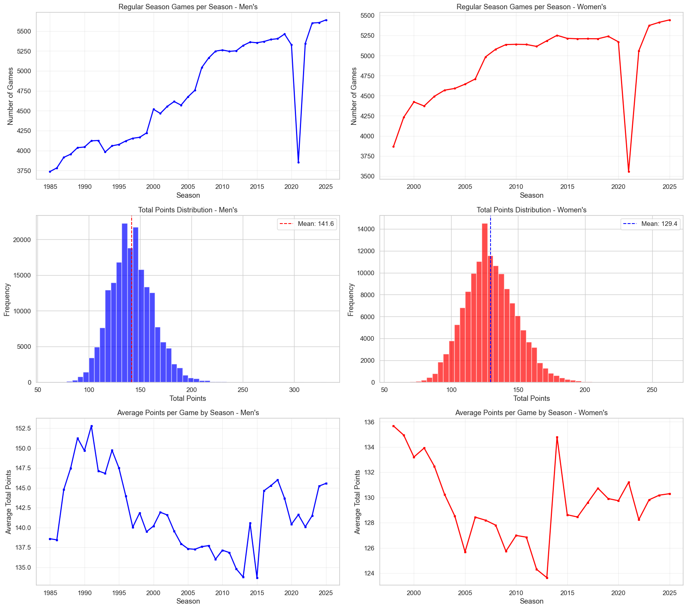{#fig:regular-season-games-overview width=80%}

In a second step, several visualizations were created to get a better understanding of the data. @fig:regular-season-games-overview shows multiple sub-plots of general insights about regular season games over the years. Each plot shows insights for both men on the right and women on the left.

The top plots show the total number of games per season, with an upward trend for men from around 3,750 games in 1985 to over 5,500 games in 2025. The women's games show a similar trend starting at around 3,800 games in 1998 to almost 5,500 games in 2025. An obvious outlier for both genders is the 2021 season, which had significantly fewer games due to the COVID-19 pandemic.

The middle plots show both the total points scored in a game in a histogram and the average points scored per game over the years. Both gender's distributions align closely with a normal distribution, but while the women's mean is at 129.4 points per game, the men's average is significantly higher at 141.6 points per game.

The bottom plots show the average points per game over the years, with both genders showing a downward trend starting in the mid-90s until around 2010, after which the average points jumped up again and have been relatively stable since then. While reasons for these patterns are speculation, they could be linked to changes in game rules, playing styles, or coaching strategies over the years.

The most important take-away from these plots is that men's games tend to have higher scores than women's games, but patterns in the scores are similar for both genders.

After having analyzed total scores in regular season matches, the next step was to analyze the score differences between winning and losing teams both in regular season and tournament games. While @fig:regular-season-games-overview included games from 1985 for men and 1998 for women, @fig:score-analysis uses the detailed box-score results described in @sec:regular-season-detailed-results and @sec:tournament-detailed-results starting from 2003 for men and 2010 for women.

::: {#fig:score-analysis}
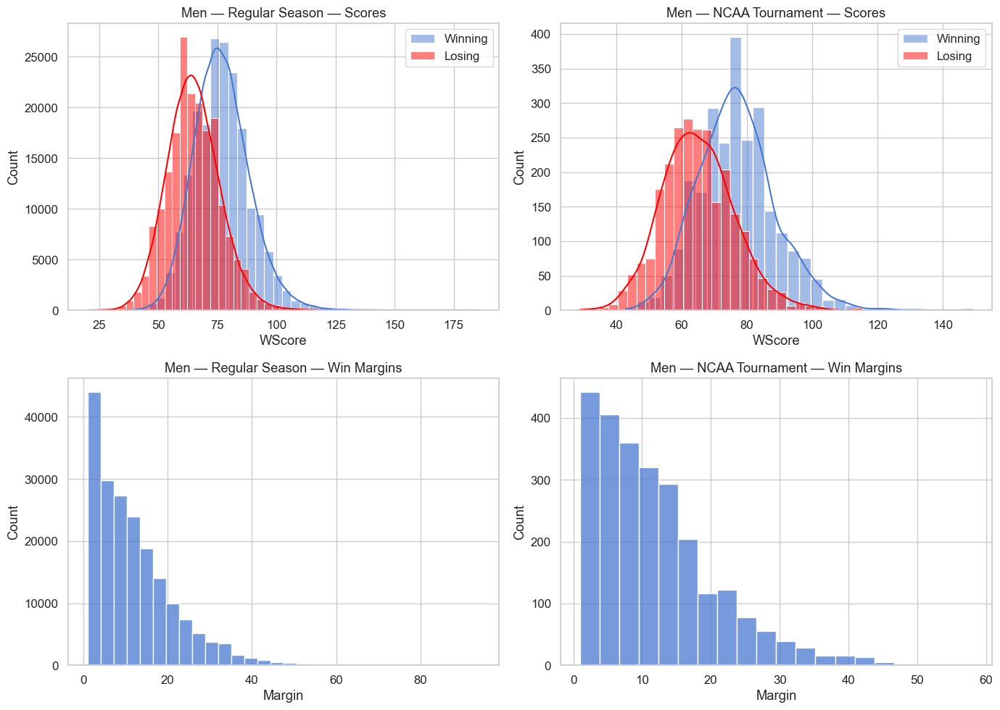{width=45%}
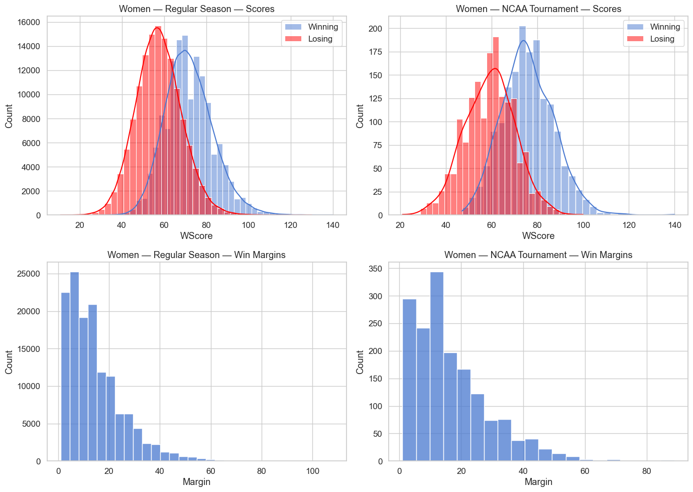{width=45%}

Score Analysis for both (a) men and (b) women.
:::

@fig:score-analysis again shows the same analysis for men in the left plot and women in the right plot. The top plots show the distribution of scores for both winning (blue) and losing (red) teams in regular season games (top-left) and tournament games (top-right). For regular season games, the distribution for both genders align closely with a normal distribution, with winning teams having a higher mean score than losing teams, as expected. For tournament games, also align closely with a normal distribution, but it is less pronounced, likely due to the lower amount of games on record. One minor deviation from the normal distribution is shown in the men's losing scores, which show a slight right-skewed distribution. This could be due to earlier rounds in tournaments where higher-seeded teams play lower-seeded teams, leading to more lopsided scores.

The bottom plots show the distribution of margins of victory (winning score - losing score) for both regular season games (bottom-left) and tournament games (bottom-right). Overall, most games are close games with a margin of victory below 20 points for both regular season and tournament games. However, there are also a significant number of blowout games with margins above 20 points. These blowouts occur more in women's basketball and especially in women's tournament games. This could hint at a higher team-strength gap in women's than men's basketball in general, but also in the teams that clinch a spot for the final tournament.

Another interesting aspect to sports is the location where games are played and how that affects the outcome. @fig:location-analysis tries to analyze whether NCAA Division I basketball games support the hypothesis that teams perform better on their home court.

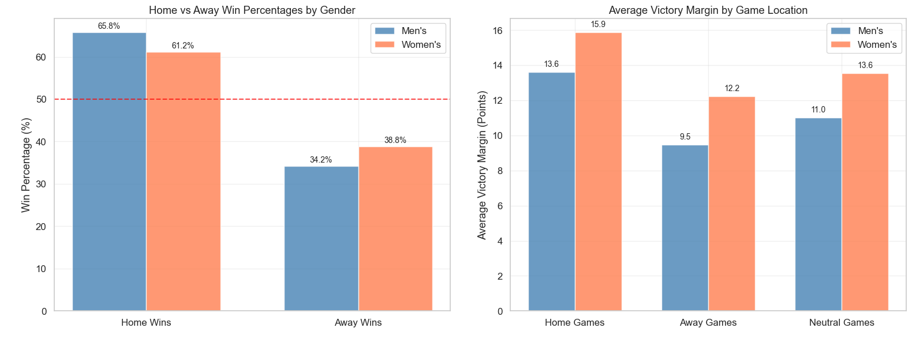{#fig:location-analysis width=80%}

The left plot in @fig:location-analysis shows the percentage of games won by the home team (left) and away team (right) for both men (blue) and women (orange). Overall, both genders show a significantly higher win percentage for home teams than away teams, with men having a home win percentage of 65.8% and women 61.2%. The right plot supports this finding by showing the average margin of victory for the winning team based on game location. Both genders show the highest margin of victory at home games, then at neutral locations and the lowest margin of victory for away games, again indicating that away-games are harder to win. 

For the NCAA tournaments, all games are played at neutral locations, which lowers the significance of this finding in the context of this project, but for a task where regular season games are predicted game location must definitely be taken into account.

As described in @sec:introduction, teams entering the NCAA tournament are seeded from 1 to 16 within their regional brackets. These seeds are intended to reflect the relative strength of the teams, with lower seeds being stronger teams. An interesting question is how well these seeds reflect the actual outcomes of the games. @fig:seed-upsets shows for both men (left) and women (right) both the win percentage of a given seed with a trend line (left) and the percentage of upsets in a pie chart (right).

::: {#fig:seed-upsets}
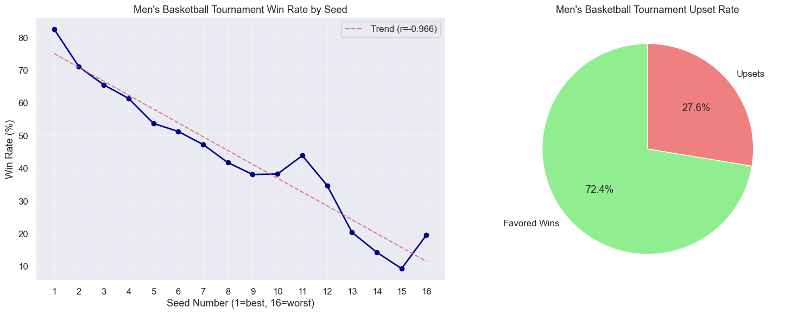{width=45%}
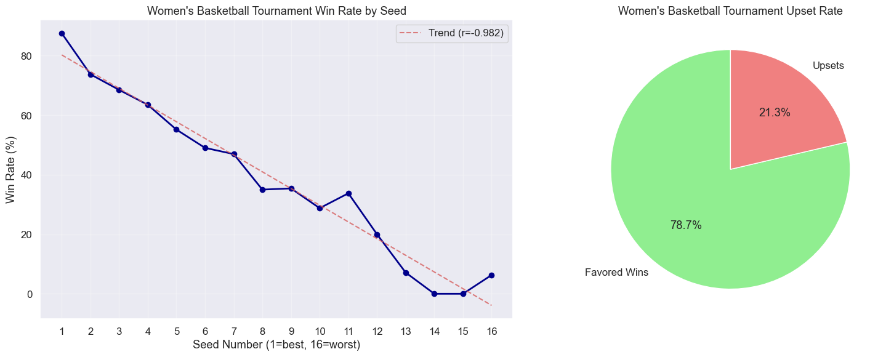{width=45%}

Upset rate by seed for both (a) men and (b) women.
:::

In the left plots of @fig:seed-upsets, a clear downward trend can be observed for both genders, indicating that lower-seeded teams tend to win more often than higher-seeded teams, proving the merit of the seeding criteria. However, there are also some anomalies, that can again be observed for both genders. For example, seeds 1, 11 and 16 are outperforming the trend line, while seeds 8, 13 and 14 are underperforming for both genders. Seeing the same anomalies occur for both genders, hints at structural reasons behind these anomalies, which could be explained through the bracket generation. The entire path a team has to take to win the tournament is determined by their seed and stays the same every year. Therefore, some seeds might have a more difficult path to the championship than others, leading to underperformance compared to the expected win percentage based on seed alone.

The right plots of @fig:seed-upsets show the overall percentage of upsets in tournament games. An upset is defined as a game where the lower-seeded team loses against a higher-seeded team. In the men's tournament, 27.6% of all historical games were upsets, while in the women's tournament the upset rate was significantly lower at 21.1%. This again hints at a higher team-strength gap in women's basketball, leading to fewer upsets.

Finally, the correlation of box-score features for the winning team with the margin of victory was analyzed to get a better understanding of which features are most important in determining the outcome of a game and if there are significant statistical differences in men's and women's basketball. @fig:win-margin-correlation shows the Pearson correlation coefficients of all features of the winning team with the margin of victory for both men (left) and women (right).

::: {#fig:win-margin-correlation}
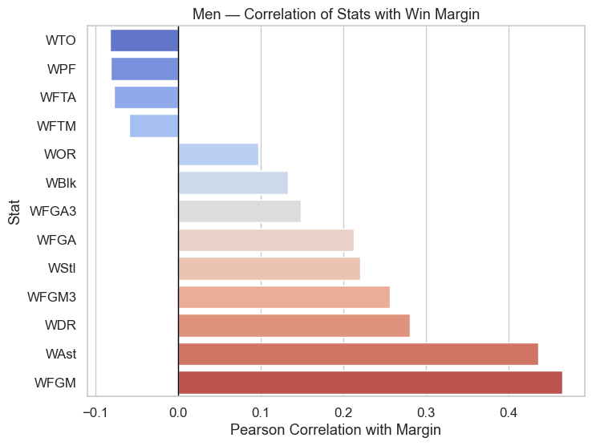{width=45%}
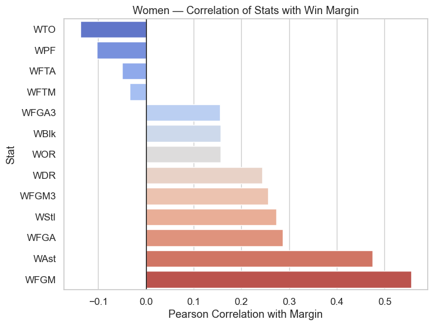{width=45%}

Pearson correlation of features and win margin for both (a) men and (b) women.
:::

Both genders show the same features having positive and negative correlations with the margin of victory. For both genders, features most positively correlated with margin of victory are field goals made (WFGM) and Assists (WAst). This is intuitive, as making more field goals directly increases a team's score, and assists often indicate effective teamwork and offensive efficiency, leading to higher scoring opportunities. On the other hand, features most negatively correlated with margin of victory are turnovers (WTO) and personal fouls (WPF). This also makes sense, as turnovers result in lost scoring opportunities and can lead to easy points for the opposing team, while personal fouls can disrupt a team's rhythm and lead to free throws for the opponent. 

Surprisingly, attempted free throws (WFTA) as well as made free throws (WFTM) show a negative correlation with margin of victory, although they directly contribute to a team's score. There is no obvious explanation for this phenomenon, but one possible reason could be that free throws are the lowest scoring opportunity in basketball only yielding 1 point per successful attempt. Therefore, teams that rely heavily on free throws might be less efficient overall compared to teams that score more from field goals.

All other positively correlated features such as offensive rebounds (WOR), defensive rebounds (WDR) and 3-point field goals made (WFGM3) also intuitively make sense, as they contribute to a team's scoring ability and overall performance. The strength of correlation with the win margin only slightly differs in men's and women's basketball leading to the conclusion that the overall game dynamics are similar for both genders, and they may be treated similarly in predictive models.

## Feature Engineering {#sec:feature-engineering}

Before training the machine learning models, several features were engineered from the raw game data. The aim of these features was to capture the 
strength of a team, either in their athletic abilities or their mental resilience.

### ELO Rating {#sec:elo-rating}

The ELO rating system is a method for calculating the relative skill levels of players in the context of chess proposed by @Elo1978. It has since been adapted for various sports, including basketball.

Since the ELO system is a proven system in the world of chess and various other sports, the hope is that this translates to indicating the team strength for basketball games. In the context of NCAA basketball, the entire history of regular season and tournament games from @sec:data is processed in chronological order, sorted by season and day number, to ensure accurate sequential updating. Initially, each team is assigned a base ELO rating (1,000) and from there that rating is updated after each game based on the outcome and the expected probability of winning. The win probability for a matchup between team $A$ and team $B$ is calculated using the logistic function:

$$
P(A \text{ beats } B) = \frac{1}{1 + 10^{(R_B - R_A)/400}}
$$

where $R_A$ and $R_B$ are the ELO ratings of teams $A$ and $B$ respectively. After each game, the ELO ratings are updated according to:

$$
R_A^{new} = R_A^{old} + K \cdot (S_A - P(A \text{ beats } B))
$$

where $K$ is a constant that determines how much ratings change after each game (typically set between 16 and 32), and $S_A$ is the actual outcome (1 for a win, 0 for a loss). The same update is applied symmetrically to team $B$.

After thorough experimentation two additional changes were made to the traditional ELO rating system explained above. First, win-margins were taken into account to adjust the K-factor dynamically based on how decisive a victory was. This means that a team winning by a large margin would gain more ELO points than a team winning by a small margin, reflecting the dominance of the performance. Similarly, a team losing by a large margin would lose more ELO points than a team losing by a small margin. The adjusted K-factor is calculated as follows:

$$
K_{adj} = K \cdot ln(|M| + 1)
$$

where $K$ is the base K-factor (20) and $M$ is the margin of victory.

Second, on season roll-overs, e.g. from the end of the 2023 season to the start of the 2024 season, all teams' ELO ratings were regressed towards the mean rating of 1,000. This was done to account for roster changes and other off-season factors that could significantly alter a team's strength from one season to the next. The regression was done as follows:

$$
R_{new} = R_{old} \cdot (1 - r) + 1000 \cdot r
$$

where $r$ is the regression factor (0.25) determining how much a team's rating is pulled towards the base ELO.

### Team Quality {#sec:team-quality}

Team quality ratings provide a statistical measure of team strength based on game outcomes, similar to how the ELO system captures relative skill. However, while ELO focuses on win probabilities through dynamic rating updates, the quality metric directly estimates each team's expected point contribution in a matchup using Generalized Linear Models (GLMs) [@nelder2018]. This approach builds on the GLM-based team strength estimation methods discussed by @habib2025, who demonstrated that combining such metrics with ELO ratings enhances model performance across multiple architectures.

The quality rating represents a team's strength measured in points. A positive quality indicates a team that tends to outscore opponents, while a negative quality suggests a team that typically gets outscored. The difference in quality ratings between two teams approximates the expected point margin in their matchup. For example, if team $A$ has a quality of $+15$ and team $B$ has a quality of $+5$, we would expect team $A$ to win by approximately $10$ points.

To compute quality ratings, a GLM with Gaussian family is fitted to regular season game data using the formula:

$$
\text{Points}_{Diff} \sim -1 + \text{T1} + \text{T2}
$$

where $\text{Points}_{Diff}$ represents the point difference (team A's score minus team B's score), and $\text{T1}$ and $\text{T2}$ are categorical variables representing the teams. The model includes no intercept ($-1$) because the point differential should be zero when two equally strong teams play. This regression estimates each team's contribution to the point differential, effectively extracting a quality rating for every team.

To ensure the model treats team strength symmetrically regardless of which team is labeled as T1 or T2, each game is duplicated in the dataset with teams swapped. For instance, if team $A$ defeats team $B$ with scores 75-68, the dataset includes both the original game ($T1$=$A$, $T2$=$B$, $\text{Points}_{Diff}$=$+7$) and its swap ($T1$=$B$, $T2$=$A$, $\text{Points}_{Diff}$=$-7$). This redundancy forces the regression to learn that a team's strength is independent of its positional label.

An important preprocessing step adjusts scores for overtime games to normalize all games to the standard 40-minute duration. For a game with $n$ overtime periods, scores are scaled by the factor:

$$
\text{F}_{adj} = \frac{40}{40 + 5n}
$$

where each overtime period adds 5 minutes. This normalization ensures that quality ratings reflect per-minute team strength rather than being inflated by extended play.

Quality ratings are computed separately for each season, as team rosters change annually and a team's strength can vary significantly from year to year. Following the approach described by @habib2025, who emphasized the importance of temporal considerations in team strength metrics, our implementation processes each season independently to capture these year-to-year variations in team quality.

Additionally, for the data preparation process described in @sec:sliding-window-averages, quality ratings are recalculated after each game day, including all games in the window size, to ensure that the most recent team strength estimates are used when generating features for upcoming games. This dynamic updating aligns with the temporal nature of sports performance and allows the model to leverage the latest information about team capabilities.

### ELO Delta Sliding Window {#sec:elo-delta-window}

The ELO Delta Sliding Window feature captures the change in a team's ELO rating over a specified window of recent games, providing a measure of recent performance momentum beyond the absolute ELO rating itself. This feature is motivated by the hypothesis that a team's confidence and performance may be influenced not only by their overall strength but also by their recent trajectory and the rate of that trajectory. As shown by @kim2023, the concept of momentum in sports performance and incorporating dynamic changes in team ratings can capture psychological and performance trends that static ratings miss.

For each game, the ELO delta is calculated as:

$$
\Delta R_w = R_{\text{current}} - R_{w}
$$

where $R_{\text{current}}$ is the team's ELO rating at the current game and $R_{w}$ is their ELO rating $w$ games prior. A positive delta indicates improving performance, while a negative delta suggests declining performance. Teams with insufficient game history (fewer than $w$ games) are assigned a delta of zero, as there is no meaningful prior reference point.

To determine the optimal window size $w$ and its contribution weight $\omega$, a grid search was conducted to maximize the improvement in Brier score when incorporating the delta adjustment into ELO-based predictions. The adjusted win probability for a matchup between teams $A$ and $B$ is calculated as:

$$
P(A \text{ beats } B) = \frac{1}{1 + 10^{(R_B + \omega \cdot \Delta R_{B,w} - R_A - \omega \cdot \Delta R_{A,w})/400}}
$$

where $\omega$ weights the delta adjustment relative to the base ELO ratings. The grid search evaluated various combinations of window sizes and weights, selecting the pair that maximized $\text{Brier}_{\text{raw}} - \text{Brier}_{\text{adjusted}}$, where $\text{Brier}_{\text{raw}}$ represents the Brier score using only base ELO ratings and $\text{Brier}_{\text{adjusted}}$ uses the delta-enhanced predictions.

The optimal configuration was found to be a window size of $w = 3$ games with a weight of $\omega = 0.1$. This indicates that recent performance over the last three games provides meaningful predictive signal, though the effect is modest (weight of 0.1) compared to the base ELO ratings. This aligns with findings from @gomez2024, who discussed how temporal dynamics in rating systems can enhance predictive performance while maintaining interpretability.

The window tracking resets between seasons by default, ensuring that a team's momentum from one season does not inappropriately carry over to the next season when rosters and team compositions have changed. This seasonal reset parallels the ELO regression approach described in @sec:elo-rating and ensures that momentum features reflect current team dynamics rather than stale historical patterns.

### Win Streaks {#sec:win-streaks}

Win and loss streaks represent a team's recent performance momentum, capturing the psychological and performance aspects of consecutive wins or losses that may influence future game outcomes. While the ELO delta feature in @sec:elo-delta-window tracks rating changes, win streaks provide a complementary perspective by focusing on the binary outcome sequence itself, i.e. how many games a team has won or lost in a row, independent of the margin of victory or opponent strength.

The motivation for including win streaks as a feature stems from research on momentum effects in sports, where teams on winning streaks may exhibit increased confidence and cohesion, while teams on losing streaks may suffer from decreased morale or tactical difficulties [@kim2023]. While such psychological effects are difficult to measure directly, the streak feature provides a simple proxy that machine learning models can leverage to capture patterns where recent consecutive outcomes influence future performance beyond what absolute team strength metrics predict.

For each game in the dataset, the win streak feature calculates the team's current streak of consecutive wins (represented as a positive integer) or consecutive losses (represented as a negative integer). A team entering a game on a five-game winning streak would have a streak value of $+5$, while a team that has lost three consecutive games would have a streak value of $-3$. At any point in time, each team has a single streak value that is either positive (wins), negative (losses), or zero (no prior games or at a streak transition point).

The streak calculation processes games in chronological order as also done in @sec:elo-rating. For each game, before updating the streak values with the current game's outcome, the current streaks for both the winning and losing teams are recorded. After recording, the streaks are updated according to the game result:

- Winning team: $\text{streak} := max(1, \text{streak} + 1)$
- Losing team: $\text{streak} := min(-1, \text{streak} - 1)$

By default, streaks reset between seasons, as team rosters change and performance from the previous season does not meaningfully continue into the new season. This seasonal reset is consistent with the temporal separation applied to other features like ELO ratings and quality metrics, ensuring that features reflect current team dynamics.

## Dataset Preparation {#sec:dataset-preparation}

To prepare the dataset for training the machine learning models, three different approaches for aggregating the box-score statistics from @sec:regular-season-detailed-results and the engineered features from @sec:feature-engineering were implemented. These are described in the following sections.

### Season Averages {#sec:season-averages}

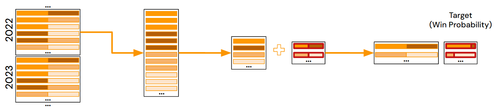{#fig:data-loader-season-average width=90%}

This dataset preparation approach is inspired by the winning solution of the 2025 Kaggle competition by @odeh2025marchMLMania. It calculates the average of all box-score statistics and engineered features for each team over each entire regular season. Additionally, it calculates the average of all box-score statistics and engineered features for any team's opponents over the entire regular season. These two sets of calculated averages are then saved for every team containing its averages and its opponents' averages. 

During the data-loading process for training and evaluating the machine learning models, features such as "Points Scored", "Season", "DayNum" and "Team ID" are dropped to prevent data leakage. Finally, end-of-season features such as the eventual ELO rating of a team and the Team Quality are added back, since Team Quality does not have an average and the final ELO before the tournament is the most relevant one for predicting tournament outcomes.

Finally, each matchup in the tournament of a given season, containing the target variable indicating the winner, is constructed by duplicating the matchup once with team A as the first team and team B as the second team and once vice versa. This is done to ensure that the machine learning models treat both teams symmetrically and do not learn any bias based on the order of the teams in the matchup. Lastly, the extracted averages for both teams are merged into the matchup data, resulting in a final dataset ready for training and evaluating the machine learning models.

The final dataset contains the following characteristics:

* 87 features
* 134 data points per gender per season
* 4690 total data points

### Weighted Season Averages {#sec:weighted-season-averages}

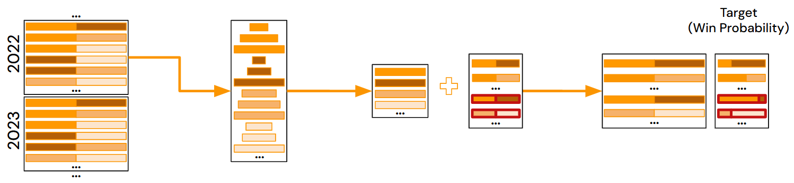{#fig:data-loader-weighted-average width=90%}

This dataset preparation approach closely resembles the one described in @sec:season-averages, but instead of calculating simple averages over the entire regular season, weighted averages are calculated where more recent games are weighted more heavily than older games. The discount factor of a given game is calculated as follows:

$$
\text{F}_{weight} = \gamma^{\text{DayNum}_{max} - \text{DayNum}_{game}}
$$

where $\gamma$ is the base discount factor (default = 0.99), $\text{DayNum}_{max}$ the maximum day number in the season and $\text{DayNum}_{game}$ the day number of the game to be weighted. This results in games played on the last day of the season having a weight of 1, while games played earlier in the season have exponentially decreasing weights based on how far back they were played.

Additionally to weighting games based on a temporal discount, both regular season and tournament games are added as data points in the final dataset (using the weighted average features of the regular season) and then similar to @sec:season-averages constructed by duplicating each matchup once with team A as the first team and team B as the second team and once vice versa. These constructed matchups are then merged with the calculated weighted season averages for both teams, resulting in a final dataset ready for training and evaluating the machine learning models. This approach significantly increases the number of data points available for training and evaluating the machine learning models.

In hindsight, the question arises whether predicting individual regular season games based on weighted average features of the same regular season has any validity. Surprisingly, as can be seen in @sec:results-weighted-season-averages this approach does seem to have merit.

The final dataset contains the following characteristics:

* 87 features
* 405’732 total data points

### Sliding Window Averages {#sec:sliding-window-averages}

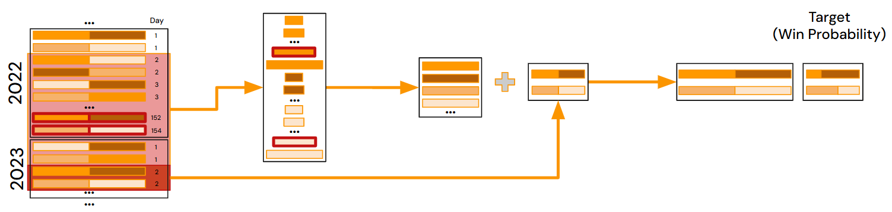{#fig:data-loader-sliding-window width=90%}

The final dataset preparation approach builds upon the weighted season averages described in @sec:weighted-season-averages, but instead of calculating weighted averages over the entire regular season, sliding window averages are calculated for every game day in chronological order, sorted by season and day number, including regular season and tournament games. This means that for each game day, the average of all box-score statistics and engineered features over a fixed window size of previous games is calculated. This allows for more dynamic feature values that can adapt to changes in team strength throughout the season.

The window size variable depending on the "DayNum" serving as predictor for the game. In every case, all games preceding the current "DayNum" in the current season are considered. Additionally, all games from the previous season with "DayNum" greater than the current "DayNum" plus the length of the NCAA tournament (22 days) are also considered, ensuring that the tournament games from the previous season are not included in the prediction of tournament games in the current season. With this approach, tournament games are predicted using the same games as in the @sec:season-averages and @sec:weighted-season-averages approaches, increasing comparability of results.

The calculation of the discount factor of a given game is also adapted to the approach in @sec:weighted-season-averages to account for the sliding window and is calculated as follows:

$$
\text{F}_{weight} = \gamma^{(\text{DayNum}_{game} + \text{Carry if is\_previous\_season else} 0) - \text{DayNum}_{max}}
$$

where $\gamma$ is the base discount factor (default = 0.98), $\text{DayNum}_{max}$ the maximum day number in the current window, $\text{DayNum}_{game}$ the day number of the game to be weighted, and $\text{Carry} = 40 + 154 = 194$ is a constant composed of the maximum day number of a season (154) plus a buffer (40) additionally downweighing games included from the previous season. $\text{is\_previous\_season}$ is a boolean flag indicating whether a data point is from the previous season.

Finally, similar to @sec:season-averages, target matchup, containing the target variable indicating the winner, is constructed by duplicating the matchup once with team A as the first team and team B as the second team and once vice versa. These constructed matchups are then merged with the calculated sliding window averages for both teams, resulting in a final dataset ready for training and evaluating the machine learning models.

Due to the nature of this approach a certain amount of past games is required to calculate the sliding window averages. Therefore, only games starting from the first tournament in the dataset where enough past games are available are included in the final dataset.

The final dataset contains the following characteristics:

* 81 features (No seed & streak features)
* 395’918 total data points

## Feature Importance {#sec:feature-importance}

As described in @sec:dataset-preparation, each of the three dataset preparation approaches results in over 80 features for every matchup. To minimize overfitting and improve computational efficiency, all features were ranked based on their importance, allowing for the number of features used for training a given machine learning model to be included as a hyperparameter during model training.

The feature importance ranking was calculated using a XGBoost model [@Chen2016] trained on the respective dataset preparation approach including all features. In total 400 boosting rounds with a maximal depth of 6 and a learning rate of 0.01 were used to ensure that the model learned to use all features. From the split statistics of the trained model, the feature importance ranking was extracted based on the *gain* metric, which measures the improvement in accuracy brought by a feature to the branches it is on. 

For every feature the mean, median and maximum gain scores were extracted and then normalized to the range $[0, 1]$. Eventually, for every feature a score was calculated as follows:

$$
\text{F}_{Score} = \text{F}_{Count} \cdot (\text{G}_{Mean} + \text{G}_{Median} + \text{G}_{Max})
$$

where $\text{F}_{Count}$ is the number of times the feature was used in a split, and $\text{G}_{Mean}$, $\text{G}_{Median}$ and $\text{G}_{Max}$ are the normalized mean, median and maximum gain scores respectively. The features were then ranked based on this score in descending order, resulting in a final feature importance ranking for each dataset preparation approach.

To ensure correctness of the feature importance ranking, the process was repeated using a Random Forest model [@Breiman2001] instead of XGBoost. The resulting feature importance rankings were very similar to the ones obtained using XGBoost, confirming the validity of the approach.

### Default Features {#sec:default-features}

To validate the feature importance ranking described in @sec:feature-importance, a default set of features was selected and additional experiments were conducted on these default features. The set of default features consists of the intersection of features used in the winning Kaggle competition solution by @odeh2025marchMLMania and the features available in each data loading approach.

# Methods
This section describes the various modelling approaches used during the project, starting with statistical approaches to several machine learning methods.

## Statistical Approaches {#sec:statistical-approaches}
To establish a baseline for our machine learning approaches, we implemented several statistical approaches. All of these models were based on the entire compact regular or tourney season results described in @sec:data.

### Random
In the context of this project the random baseline considered was a prediction of a 50% win probability for each team of every matchup in the 2025 tournament. This does not take into account any data at all, and serves as the baseline of our statistical approaches.

### Seed Ratio
With the seed ratio approach, the mean seed of a team is calculated over all the past tournaments in the dataset. If a team has not participated in any tournaments, a seed of 32 is assigned to it, which is below the worst normal seed of 16. For each matchup of the 2025 tournament that seed is then used to calculate the win probability of a team as follows:
$$
P(A \text{ beats } B) = \frac{\mu_B}{\mu_A + \mu_B}
$$

Where $\mu$ is the mean seed of the respective team, and $\mu = 32$ if the team has not participated in any tournaments.

### Win Ratio {#sec:win-ratio}
The win ratio approach is similar to the seed ratio approach, but instead of using the mean seed of a team, the win ratio over all past regular and tournament games is used. The win rate $wr$ is calculated as follows:
$$
wr = \frac{w + \alpha }{w+l + \alpha \cdot d}
$$

Where $w$ is the number of wins and $l$ is the number of losses of a team over all games in the @sec:data. To account for small sample sizes, we applied Laplace smoothing [@Laplace1814] with $\alpha = 5$ and $d = 2$. This would result in a $wr = 0.5$ for a team without any games played. The win probability for a matchup between team $A$ and $B$ is then calculated as follows:
$$
P(A \text{ beats } B) = \frac{wr_A}{wr_A + wr_B}
$$

### Head-to-Head Ratio
The head-to-head ratio approach is an extension of the win ratio approach, but instead of using the overall win ratio of a team, the head-to-head win ratio between two teams is used if they have played against each other a minimum number of games. The head-to-head win rate $hwr$ for teams $A$ and $B$ is calculated analogous to @sec:win-ratio:
$$
hwr_{A,B} = \frac{w_{A,B} + \alpha }{w_{A,B}+l_{A,B} + \alpha \cdot d}
$$

Where $w_{A,B}$ is the number of wins of team $A$ against team $B$ and $l_{A,B}$ is the number of losses of team $A$ against team $B$. The same Laplace smoothing [@Laplace1814] with $\alpha = 5$ and $d = 2$ is applied. If teams $A$ and $B$ have played less games against each other than a given threshold, the overall win ratio as described in @sec:win-ratio is used instead. The win probability for a matchup between team $A$ and $B$ is then calculated as follows:
$$
P(A \text{ beats } B) = 
\begin{cases}
hwr_{A,B} & \text{if } w_{A,B} + l_{A,B} >= c \\
\frac{wr_A}{wr_A + wr_B} & \text{otherwise}
\end{cases}
$$

Where $c$ is the minimum number of games played between two teams to use the head-to-head win ratio, which was set to $c=3$ for this project.

### Point Ratio
The point ratio approach predicts matchup outcomes based on the average points scored by teams across all past regular season and tournament games. For each team, a discounted mean score is calculated where recent games are weighted more heavily than older games. Additionally, tournament games can be weighted differently than regular season games to account for their potentially higher significance. The discounted score $ds$ for a team is calculated as:
$$
ds = \frac{1}{n} \sum_{i=1}^{n} s_i \cdot w_i \cdot \gamma^{y - y_i}
$$

Where $s_i$ is the score in game $i$, $w_i$ is the weight for the game type (regular season or tournament), $\gamma$ is the discount factor, $y$ is the current season, $y_i$ is the season of game $i$, and $n$ is the total number of games. For this project, $w_{regular} = 0.75$, $w_{tourney} = 1.0$, and $\gamma = 0.9$ was used. The actual win probability for a matchup between team $A$ and $B$ is then similarly to previous methods:
$$
P(A \text{ beats } B) = \frac{ds_A}{ds_A + ds_B}
$$

## Classical Machine Learning Models {#sec:classical-machine-learning-models}
To improve upon the statistical baselines, several classical machine learning models were experimented with.

### Models
Machine learning models of the following types were trained during the course of this project:

- Logistic Regression [@Cox1958]
- Support Vector Machine (SVM) [@Cortes1995]
- Random Forest [@Breiman2001]
- XGBoost [@Chen2016]
- CatBoost [@Prokhorenkova2018]

XGBoost and CatBoost were implemented using their respective Python libraries [@xgboost-website; @catboost-website], while scikit-learn [@scikit-learn-website] was used for the other models. Each of these models has its own set of hyperparameters that were considered during their respective experiments.

### Ensemble Training Strategy {#sec:ensemble-training-strategy}
For these classical machine learning models, an ensemble training approach was implemented. In this approach, in combination with the data loading approach of @sec:season-averages each season was used once as validation data and a model trained with all other seasons as training data. 

At inference time, the average of the predictions by the individual model is used as the final prediction. This temporal ensemble strategy tries to counteract overfitting by only using a single season as validation data.

## Neural Networks
As a final modelling approach, deep learning techniques were explored. The main idea was that a deep enough neural network (NN) could extract more features from the already existing ones and thus make better predictions than the classical machine learning models (@sec:classical-machine-learning-models), especially on the larger datasets (@sec:dataset-preparation).

To experiment with deep learning approaches, a flexible neural network architecture was implemented using PyTorch Lightning [@Falcon2019]. The neural network framework supports various architectural configurations and training strategies to predict win probabilities.

### Architecture {#sec:neural-network-architecture}
The architecture used is a deep neural network with theoretically any amount of fully connected layers. To experiment with different variations of that architecture, the depth of the network and the width and activation of each layer were made configurable as hyperparameters.

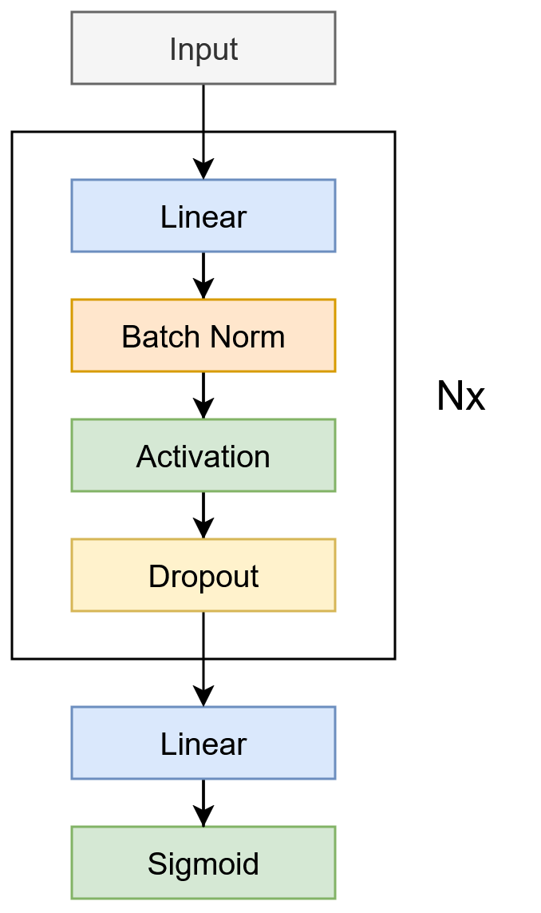{#fig:neural-network-architecture width=20%}

@fig:neural-network-architecture shows a schematic of the neural network architecture used. The input can be any of the features described in @sec:dataset-preparation, which are then passed through multiple blocks of linear layers, ending in a sigmoid activation, which then represents the win probability prediction.

### Loss Functions {#sec:loss-functions}
Next to the two standard loss functions, mean squared error (MSE) and binary cross-entropy (BCE), a custom loss function with the goal to force the model to make over confident predictions. Inspiration for this were the winning solutions of the Kaggle competition, which manually push confident predictions to be even more confident. One of these examples is the 1st place solution by @odeh2025marchMLMania.

The idea was to use BCE with a penalty term, that increases the loss for predictions that far from the target. A fitting penalty term seemed to be the entropy [@shannon1948a; @shannon1948b], which represents the uncertainty of a random variable, in this case the win probability.

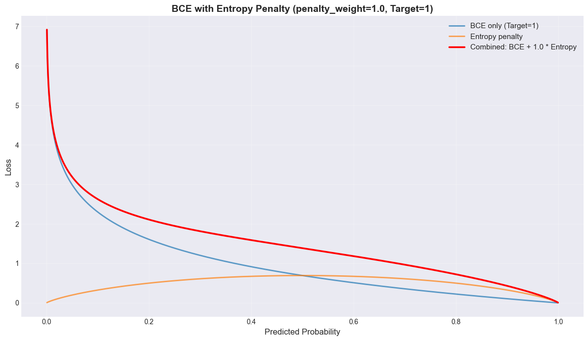{#fig:bce-entropy-combination width=50%}

@fig:bce-entropy-combination shows the curve of the BCE loss, the entropy and an addition of the two given the predictions for a true label of $1$. As can be seen by the combination of the BCE and the entropy, the loss is increased considerably for uncertain predictions (near $0.5$), while confident predictions (near $0$ or $1$) are only slightly affected. Based on this, the following loss funtion was defined:

$$
L = \text{BCE}(y_{pred}, y_{true}) + \lambda H(y_{pred})
$$

where $H(y_{pred}) = -y_{pred} \log(y_{pred}) - (1-y_{pred}) \log(1-y_{pred})$ is the entropy of the prediction, and $\lambda$ is a configurable weight. To find a $\gamma$ for which the loss of confident predictions is the most distinct, while maintaining a monotonically decreasing loss towards the true label, a binary search was conducted, which lead to $\gamma \approx 3.592$, which we reduced to $\gamma = 3.5$ for simplicity. The graph of the final loss function can be seen in @fig:bce-with-entropy-penalty. 

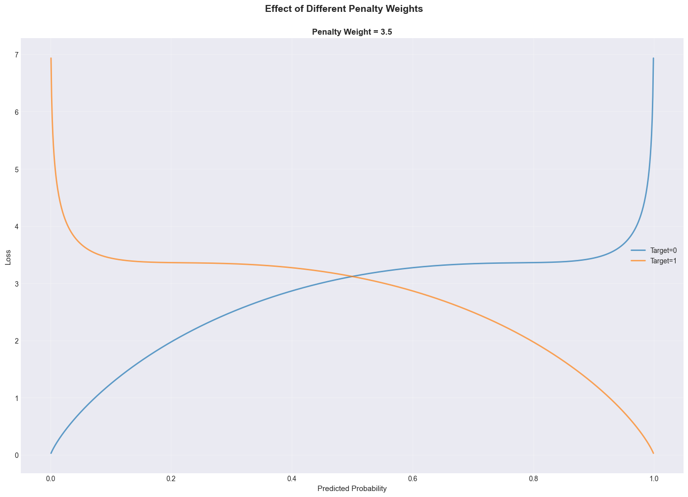{#fig:bce-with-entropy-penalty width=50%}

### Training Configuration

With the architecture as hyperparameter approach the training could be defined by the following groups of hyperparameters.

+------------------+---------------------------------------------------------------------------------------------+
| Hyperparameter   | Description                                                                                 |
+==================+=============================================================================================+
| Architecture     | The architecture of the neural network was described in @sec:neural-network-architecture.   |
|                  | Specified as an array of widths of linear layers, where the length of the array determines  |
|                  | the depth of the network.                                                                   |
+------------------+---------------------------------------------------------------------------------------------+
| Learning Rate    | The learning rate together with learning rate schedulers and their specific parameters.     |
|                  | Used schedulers include StepLR, ReduceLROnPlateau, ExponentialLR and CosineAnnealingLR.     |
+------------------+---------------------------------------------------------------------------------------------+
| Loss Function    | The objective function used to train the model. Possible values included MSE, BCE, and the  |
|                  | BCE with entropy penalty described in @sec:loss-functions.                                  |
+------------------+---------------------------------------------------------------------------------------------+
| Optimization     | The framework supports various optimizers, however, the optimizer used for all experiments  |
|                  | was AdamW.                                                                                  |
+------------------+---------------------------------------------------------------------------------------------+
| Regularization   | Dropout layers and weight decay were used to counteract overfitting.                        |
+------------------+---------------------------------------------------------------------------------------------+

: Main neural network training hyperparameters {#tbl:neural-network-hyperparameters}

@tbl:neural-network-hyperparameters summarizes the main hyperparameters used to configure the training, it is not an exhaustive list of all possible hyperparameters. The implementation supported even more hyperparameters, such as different weight initialization strategies, and more values for certain hyperparameters, like the mean absolute error loss function, but for simplicity these were not considered during this project.

The training procedure includes early stopping based on the validation loss, as well as model checkpointing. The progress of the training was tracked using Weights & Biases [@wandb], which ultimately served as the tool to select the best model out of multiple training runs.
 
# Experiments {#sec:experiments}
The experiments conducted can be divided into the experiments with the statistical approaches and the experiments with the machine learning approaches. The statistical approaches were run on their respective subset of data as described in @sec:statistical-approaches. For the machine learning approaches, experiments were conducted for each model type (@sec:classical-machine-learning-models, @sec:neural-network-architecture) and each dataset (@sec:dataset-preparation), with a few exceptions. Additionally, ensemble experiments were conducted for each classical model type (@sec:ensemble-training-strategy).

+---------------------------------------------------------+----------------------+
| Experiment Type                                         | Models               |
+=========================================================+======================+
| Season Averages                                         | All                  |
| (@sec:season-averages)                                  |                      |
+---------------------------------------------------------+----------------------+
| Season Averages Ensembles                               | All, except NN & SVM |
| (@sec:season-averages, @sec:ensemble-training-strategy) |                      |
+---------------------------------------------------------+----------------------+
| Weighted Season Averages                                | All, except SVM      |
| (@sec:weighted-season-averages)                         |                      |
+---------------------------------------------------------+----------------------+
| Sliding Window Averages                                 | All, except SVM      |
| (@sec:sliding-window-averages)                          |                      |
+---------------------------------------------------------+----------------------+

: Overview of the conducted experiments {#tbl:experiment-overview}

@tbl:experiment-overview summarizes the experiments that were conducted for each dataset and model type. The SVM model was not trained on the Weighted Season Averages and Sliding Window Averages datasets because the SVM was not able to handle the size of these datasets.

All experiments were conducted using Weights & Biases [@wandb] sweeps with Bayesian optimization of the respective models hyperparameters, including dataset specific hyperparameters (see following sections). Like this an experiment for each model and experiment type as shown in @tbl:experiment-overview was run with a maximum of 100 runs. There was one exception for the latter for the neural networks, where one such experiment was run per loss function (@sec:loss-functions).

At the end of each experiment, the best model according to the lowest Brier score on the validation set of the respective dataset was selected for final evaluation on the test set on Kaggle.

## Dataset Hyperparameters
The dataloader of each dataset allows to specify a number $n$ of ranked features to use during training. The top $n$ features based on the features importance (@sec:feature-importance) would then be selected for training. Additionally the experiments with the Weighted Season Averages dataset (@sec:weighted-season-averages) allowed to specify weights for regular season and tournament games, as well as a discount factor for older games. These hyperparameters were also optimized during the sweeps.

## Data Split
The split into training and validation set depends on the experiment type. @tbl:data-split-overview summarizes how the data is splits for each experiment type.

+---------------------------+--------------------------+------------------+--------------------------+
| Experiment Type           | Training Data            | Validation Data  | Description              |
+===========================+==========================+==================+==========================+
| Season Averages           | Seasons 2003-2023        | Season 2024      |                          |
+---------------------------+--------------------------+------------------+--------------------------+
| Season Averages Ensembles | Each season, except one, | Each season once | @sec:ensemble-data-split |
|                           | for all seasons once     |                  |                          |
+---------------------------+--------------------------+------------------+--------------------------+
| Weighted Season Averages  | 75%                      | 25%              | Sampled from             |
|                           |                          |                  | entire dataset           |
+---------------------------+--------------------------+------------------+--------------------------+
| Sliding Window Averages   | 75%                      | 25%              | Sampled from             |
|                           |                          |                  | entire dataset           |
+---------------------------+--------------------------+------------------+--------------------------+

: Overview of the data splits for each experiment type {#tbl:data-split-overview}

### Ensemble Data Split {#sec:ensemble-data-split}

Similarly to the data split for the Season Averages experiments (@sec:season-averages), all other seasons except one are used as training data and the remaining season as validation data. However, an ensemble of models is trained with every season used as validation data once to train one model.

For example, with seasons 2003-2024 available, one model is trained with seasons 2003-2023 as training data and season 2024 as validation data, another model is trained with seasons 2003-2022 and 2024 as training data and season 2023 as validation data, and so on.

# Results {#sec:results}

All results described in this chapter follow the train/validation split described in @tbl:data-split-overview. The metric displayed 
is the Brier score, which is the evaluation metric used on Kaggle. Lower Brier scores are better. Additionally, the rank achieved on 
the Kaggle leaderboard for the respective test set is displayed. The Kaggle leaderboard contains a total of 1,727 submissions [@mmlm2025].

## Statistical Baselines {#sec:results-statistical-baselines}

| Model        | Train | Validation |    Test    |  Rank   |
|--------------|:-----:|:----------:|:----------:|:-------:|
| Point Ratio  |   -   |   0.2484   |   0.2548   |  1,423  |
| Random       |   -   |   0.2500   |   0.2500   |  1,272  |
| Head-to-Head |   -   |   0.2429   |   0.2350   |  1,210  |
| Win Ratio    |   -   |   0.2321   |   0.2284   |  1,190  |
| Seed Ratio   |   -   | **0.1961** | **0.1766** | **948** |

: Results Baseline Models {#tbl:results-baseline-models}

Among the statistical baseline models, Seed Ratio achieved the best performance with a validation Brier score of 0.1961 and test score of 0.1766, ranking 948th. The random baseline per definition has a validation and test score of 0.2500, ranking 1,272nd. Head-to-Head Ratio and Seed Ratio models performed slightly better than random with validation scores of 0.2429 and 0.2321 respectively, and test scores of 0.2350 and 0.2284, ranking 1,210th and 1,190th respectively. The Point Ratio model performed worst among all baselines with validation and test scores of 0.2484 and 0.2548 respectively, ranking 1,423rd.

## Season Averages {#sec:results-season-averages}

| Model                           |   Train    | Validation |    Test    |  Rank   |
|---------------------------------|:----------:|:----------:|:----------:|:-------:|
| Support Vector Machine          |   0.1804   |   0.1533   |   0.1369   |   768   |
| Logistic Regression             |   0.1671   |   0.1587   |   0.1191   |   288   |
| Random Forest                   | **0.1480** |   0.1547   | **0.1178** | **260** |
| XGBoost                         |   0.1675   |   0.1587   |   0.1234   |   408   |
| CatBoost                        |   0.1639   |   0.1561   |   0.1427   |   815   |
| Neural Network                  |   0.1916   | **0.1526** |   0.1251   |   521   |
| Neural Network - BCE            |   0.1902   |   0.1561   |   0.1189   |   283   |
| Neural Network - BCE + Entropy  |   0.2144   |   0.1551   |   0.1221   |   361   |

: Results Season Averages {#tbl:results-season-averages}

Random Forest achieved the best test performance with a score of 0.1178 and rank 260, while also having the lowest training score of 0.1480. Neural Network achieved the best validation score of 0.1526 but ranked lower at 521st with a test score of 0.1251. Neural Network - BCE and Logistic Regression obtained test scores of 0.1189 (rank 283) and 0.1191 (rank 288) respectively, both closely matching Random Forest's performance. The CatBoost and SVM models showed the highest test scores of 0.1427 (rank 815) and 0.1369 (rank 768) respectively. All models achieved very similar validation scores, ranging from 0.1526 to 0.1587, but more varying test scores ranging from 0.1178 to 0.1427. Compared to the ensemble variants in @tbl:results-season-averages-ensembles, individual models showed better test scores, with Random Forest at 0.1178 outperforming the best ensemble Logistic Regression model at 0.1189. Relative to the statistical baselines in @tbl:results-baseline-models, all machine learning models substantially improved performance, with the worst ML model (CatBoost at 0.1427) still outperforming the best baseline (Seed Ratio at 0.1766) by 0.0339.

| Model                  |   Train    | Validation |    Test    |  Rank   |
|------------------------|:----------:|:----------:|:----------:|:-------:|
| Support Vector Machine |   0.1627   |   0.1595   |   0.1242   |   453   |
| Logistic Regression    |   0.1673   |   0.1603   |   0.1218   |   351   |
| Random Forest          |   0.1532   |   0.1568   |   0.1184   |   270   |
| XGBoost                | **0.1119** |   0.1557   |   0.1241   |   448   |
| CatBoost               |   0.1588   |   0.1568   |   0.1192   |   290   |
| Neural Network         |   0.1933   | **0.1538** | **0.1181** | **266** |

: Results Season Averages - Default features {#tbl:results-season-averages-default-features}

With default features, Neural Network achieved the best test score of 0.1181 (rank 266) and best validation score of 0.1538, though it showed the highest training score of 0.1933. Random Forest obtained 0.1184 on test (rank 270), slightly higher than Neural Network. CatBoost achieved 0.1192 (rank 290), significantly improving from its ranked feature variant in @tbl:results-season-averages (0.1427, rank 815). Compared to the models in @tbl:results-season-averages where ranked features were used as hyperparameters, default features generally produced similar results, however with a significantly lower spread in test scores from 0.1181 to 0.1242. While the best default feature model (Neural Network at 0.1181) marginally exceeded the best optimized model (Random Forest at 0.1178) by 0.0003, the worst default feature model (SVM at 0.1242) substantially exceeded the worst optimized model (CatBoost at 0.1427).

## Season Averages Ensembles {#sec:results-season-averages-ensembles}

| Model                  |   Train    | Validation |    Test    |  Rank   |
|------------------------|:----------:|:----------:|:----------:|:-------:|
| Logistic Regression    |   0.1668   | **0.1676** | **0.1189** | **283** |
| Random Forest          | **0.1473** |   0.1684   |   0.1232   |   401   |
| XGBoost                |   0.1612   |   0.1681   |   0.1213   |   335   |
| CatBoost               |   0.1581   |   0.1682   |   0.1208   |   326   |

: Results Season Averages Ensembles {#tbl:results-season-averages-ensembles}

In the ensemble experiments, Logistic Regression achieved the best test score of 0.1189 (rank 283) and best validation score of 0.1676. CatBoost obtained 0.1208 on test (rank 326), followed by XGBoost at 0.1213 (rank 335). Random Forest showed the lowest training score of 0.1473 but achieved 0.1232 on test (rank 401). All ensemble models showed validation and test scores clustered between 0.1676 and 0.1684. and 0.1189 and 0.1232 respectively, therefore exhibiting less variance compared to individual models in @tbl:results-season-averages. Compared to individual models in @tbl:results-season-averages, ensemble XGBoost (0.1213) and CatBoost (0.1208) outperformed their individual counterparts (0.1234 and 0.1427 respectively), while the other models performed slightly worse.

| Model                  |   Train    | Validation |    Test    |  Rank   |
|------------------------|:----------:|:----------:|:----------:|:-------:|
| Logistic Regression    |   0.1658   | **0.1674** |   0.1186   |   278   |
| Random Forest          |   0.1531   |   0.1685   | **0.1171** | **245** |
| XGBoost                |   0.1568   |   0.1678   |   0.1181   |   266   |
| CatBoost               | **0.1405** |   0.1678   |   0.1182   |   267   |

: Results Season Averages Ensembles - Default features {#tbl:results-season-averages-ensembles-default-features}

With default features, Random Forest achieved the best test score of 0.1171 (rank 245), despite showing a higher validation score of 0.1685. XGBoost obtained 0.1181 on test (rank 266), followed closely by CatBoost at 0.1182 (rank 267). Logistic Regression achieved 0.1186 (rank 278) and the best validation score of 0.1674. Compared to the variants where ranked features were used as hyperparameters in @tbl:results-season-averages-ensembles, default features produced better results for every model type, with Random Forest improving from 0.1232 to 0.1171. This ensemble Random Forest (0.1171) matched the best score in @tbl:results-weighted-season-averages (CatBoost at 0.1171) and @tbl:results-sliding-window-averages (Neural Network - BCE at 0.1171), representing tied second-best performance across all approaches.

## Weighted Season Averages {#sec:results-weighted-season-averages}

| Model                             |   Train    | Validation |    Test    |  Rank   |
|-----------------------------------|:----------:|:----------:|:----------:|:-------:|
| Logistic Regression               |   0.1520   |   0.1520   |   0.1232   |   401   |
| Random Forest                     |   0.1508   |   0.1550   |   0.1204   |   316   |
| XGBoost                           |   0.1508   |   0.1549   |   0.1220   |   357   |
| CatBoost                          | **0.1500** |   0.1531   | **0.1171** | **245** |
| Neural Network                    |   0.1514   |   0.1526   |   0.1215   |   341   |
| Neural Network - Default Features |   0.1538   |   0.1530   |   0.1231   |   397   |
| Neural Network - BCE              |   0.1510   | **0.1513** |   0.1247   |   507   |
| Neural Network - BCE + Entropy    |   0.1886   |   0.1855   |   0.1265   |   570   |

: Results Weighted Season Averages {#tbl:results-weighted-season-averages}

CatBoost achieved the best test score of 0.1171 (rank 245) and lowest training score of 0.1500. Neural Network - BCE obtained the best validation score of 0.1513 but achieved 0.1247 on test (rank 507). Neural Network - BCE + Entropy showed the highest scores with 0.1886 on training, 0.1855 on validation, and 0.1265 on test (rank 570). CatBoost's test score of 0.1171 matched the best results from @tbl:results-season-averages-ensembles-default-features (Random Forest at 0.1171) and @tbl:results-sliding-window-averages (Neural Network - BCE at 0.1171), achieving tied best performance across these approaches. This represented a substantial improvement over individual Season Averages models in @tbl:results-season-averages where CatBoost achieved 0.1427. Except for the CatBoost model, all other models showed worse test performance than at least one of their counterparts in @sec:results-season-averages and @sec:results-season-averages-ensembles.

## Sliding Window Averages {#sec:results-sliding-window-averages}

| Model                             |   Train    | Validation |    Test    |  Rank   |
|-----------------------------------|:----------:|:----------:|:----------:|:-------:|
| Logistic Regression               |   0.1763   |   0.1773   |   0.1185   |   274   |
| Random Forest                     | **0.1650** |   0.1785   |   0.1228   |   386   |
| XGBoost                           |   0.1773   |   0.1779   | **0.1168** | **238** |
| CatBoost                          |   0.1655   |   0.1778   |   0.1195   |   297   | 
| Neural Network                    |   0.1779   |   0.1772   |   0.1187   |   278   |
| Neural Network - Default Features |   0.1781   |   0.1784   |   0.1213   |   335   |
| Neural Network - BCE              |   0.1777   | **0.1771** |   0.1171   |   245   |
| Neural Network - BCE + Entropy    |   0.2215   |   0.2221   |   0.1230   |   393   |

: Results Sliding Window Averages {#tbl:results-sliding-window-averages}

XGBoost achieved the best test score of 0.1168 (rank 238), representing the best performance across all experiments conducted. Neural Network - BCE obtained 0.1171 on test (rank 245), matching the top scores from @tbl:results-season-averages-ensembles-default-features and @tbl:results-weighted-season-averages. Random Forest showed the lowest training score of 0.1650 but achieved 0.1228 on test (rank 386). Neural Network - BCE + Entropy demonstrated the highest training and validation scores of 0.2215 and 0.2221 respectively, with a test score of 0.1230 (rank 393). All models except Neural Network - BCE + Entropy showed closely clustered validation scores between 0.1771 and 0.1785. Compared to Season Averages models in @tbl:results-season-averages, XGBoost improved from 0.1234 to 0.1168, demonstrating the value of sliding window features over season-averaged statistics. The XGBoost model's rank of 238 represents the highest achieved ranking among all experiments, beating the best models of both ensemble methods and weighted averaging strategies.

# Discussion {#sec:discussion}
@TODO

- Data loader approaches - different ones (from the winning solution) can lead to better performance
- Model does not make a huge difference in results (habib)
- Data scarcity/research gaps - new idea to improve available data
- Ensemble models (of same model type) don't necessarily yield better results with concurrent methods
- Simple statistical models don't perform very well, also seen in existing research
- Equal data loader - models have similar validation scores, but test scores vary more between the models
    - Ensemble models show lower variance between validation and test score
    - Could point to better generalization but not to win competition
- Hard threshold at a certain Brier Score for each dataset, validation: 0.15, test at 0.12
    - Stagnates there
- Engineered features were important (habib)
- Direct comparison with the leaderboard is difficult because we did not manually change our model's predictions.
    - A vain approach of a more scientific idea with a custom loss function

# Conclusion {#sec:conclusion}
@TODO

- There is a certain unpredictability in sport
- Upset rate aligns with model accuracy
- We addressed several gaps in existing research and compared approaches across different methodologies (see paragraph below)
- Performance depends more on data preparation than on model (complexity). Can achieve similar performance with simple models.

Taken from Existing Research, but think rephrased would fit better here:

> Our research addresses several gaps in this existing literature. While previous work often focuses on single
> methodological paradigms (pure statistical, classical ML, or deep learning), we provide systematic comparison across
> these approaches using identical feature sets and evaluation protocols. Our temporal ensemble strategy, where models are
> trained separately on different historical seasons and predictions averaged, directly addresses overfitting concerns
> while maintaining the ensemble diversity benefits documented by @yuan2015. We incorporate comprehensive feature
> engineering informed by the non-box score factors emphasized by @kim2023, the dynamic rating principles from @kvam2006
> and @constantinou2013, and the awareness of data contamination from @yuan2015. Finally, our parallel analysis of both
> men's and women's tournaments enables investigation of whether predictive patterns and optimal methodologies generalize
> across these related but distinct competitive environments.

## Future Work
One potential drawback of the approaches explored in this project is how the data was prepared and fed to the models. Each approach included an aggregation of the available data, which comes with a loss of information. For future work, we propose using the data without direct aggregation, instead considering the time series aspect by predicting matchup outcomes based on $n$ or all previous matchups. One approach would be to concatenate the statistics of the past $n$ games of each team in the matchup and use this as the input vector (for example, to a deep neural network) to predict the win probability of the current game. Another approach might be to feed the entire statistics of $n$ past games from each team to a recurrent neural network as samples at separate time steps and train a classification head on the latent representation of each team's series.

Another aspect that could be explored is different sources of data. One specific example would be to base predictions on the performance of individual players within each team, rather than on the team overall.

## Lessons Learned
@TODO

- First project with such a big array of models
- Important to make a proper analysis of the data
- Achieving respectably good results was easy - improving them further difficult (80/20)
- Complexity/Larger models doesn't necessarily improve performance
- Clean data is more important than a lot of data

\newpage

# Acknowledgements
This project was implemented with the help of AI tools; GitHub Copilot (with Claude Sonnet 4.5), DeepL. They were applied for the following purposes:
- Support with the implementation of the logic
- Translation for documentation of presentation
- Rephrasing, paraphrasing and spell/grammar checks for parts of the report

# References {-}
